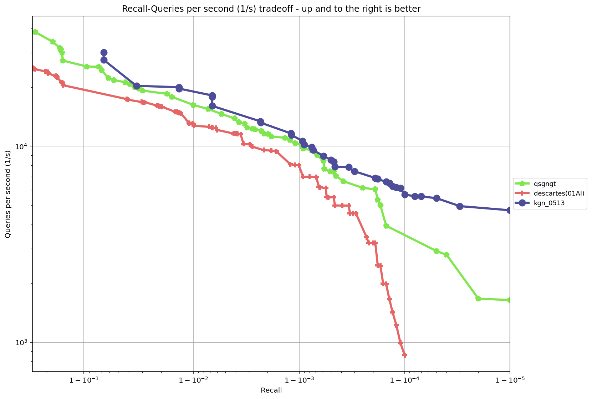

# kgn
---
## Introduction
KGN is a Nearest Neighbor Search algorithm, based on NSG  

KGN在NSG图索引的基础上进行优化所得，KGN算法最终性能达到开源代表HNSW 的1.5x~ 7x，索引内存占用仅为其1/4，在ANN-benchmark的sift-128-euclidean, fashion-mnist-784-euclidean等多个数据集上超越零一万物Descartes，算法优化点包含:  
1）. 量化加速。将原始向量数据量化int8，向量维度不变，利用SIMD加速。  
2）. 距离重排。搜索结束时进行全/半精度重排，提高排序精度。  
3）. EP灵活选择。快速筛选entry point。  
4）. 预取参数优化。搜索前通过网格搜索得到当前图结构适用的最优预取位置和预取长度。  
5）. 多重度量。角度+L2信息可以在L2高recall区域有更高的QPS。  
6）. 批插入计算。搜索过程批计算节点邻域，复用中间结构归并排序，减少频繁内存移动。  
7）. sorting network排序优化。对于批插入计算过程中小序列、高频率的排序瓶颈，针对每种长度的小序列，利用具有理论最优的最小比较次数的排序比较对网络进行排序，压榨排序性能。  
8）. 内存规整化。对图索引正则化，使得数据连续存储，提高访存速度。

---

## Installation
### Step 1: Configure environment dependencies
```bash
sudo apt install -y git cmake g++ python3 python3-setuptools python3-pip libblas-dev liblapack-dev
pip3 install wheel pybind11 faiss-cpu
```
### Step 2: Clone the Repository
```bash
git clone https://github.com/Henry-yan/kgn.git
```
### Step 3: Install the package
```bash
pip3 install kgn/pykgn-1.0.0-cp310-cp310-linux_x86_64.whl
```
---
## Usage
```python
import pykgn
```


---
## Results
The test results from running [ann-benchmarks](https://github.com/erikbern/ann-benchmarks) on an Alibaba Cloud ECS r5.2xlarge instance are as follows:

### sift-128-euclidean


---

### fashion-mnist-784-euclidean



---

### nytimes-256-angular


---