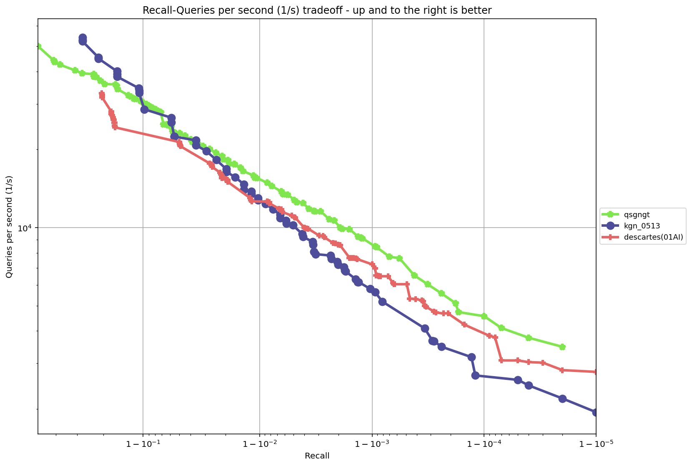
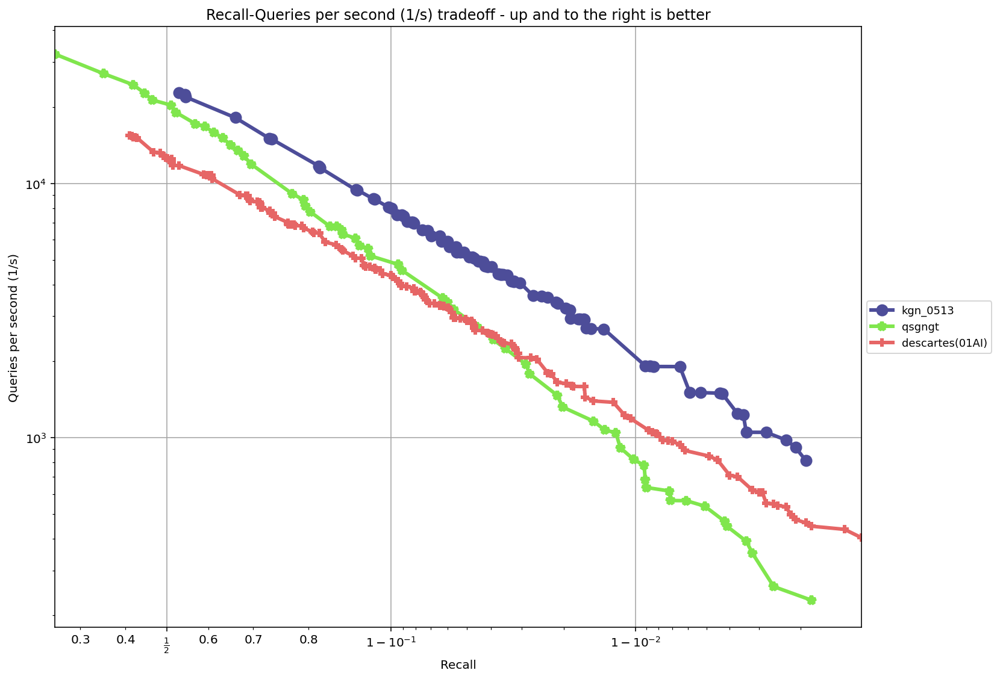
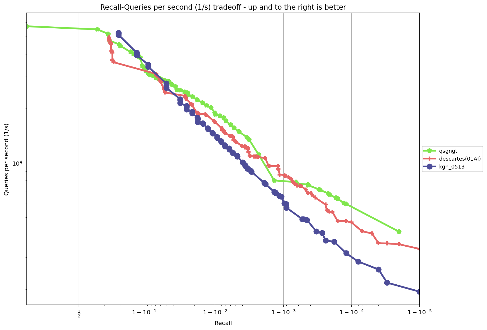

# KGN向量检索

# 安装

## 配置环境依赖
    sudo apt install -y git cmake g++ python3 python3-setuptools python3-pip libblas-dev liblapack-dev
## 下载代码
    git clone https://github.com/Henry-yan/kgn.git
## 安装
    pip3 install kgn/pykgn-1.0.0-cp310-cp310-linux_x86_64.whl

# 运行
示例python代码(包含构建与搜索)位于`./demo/`中的`run.py`文件，其对应的配置文件为`./demo/config.json`。

# 具体运行示例
## 导入python包
    import pykgn

## 构建索引并保存
    Index = kgn.Index(nb=n, dim=d, base=X, topK=topk, metric=metric, level=level, R=R, R2=R2)
    Index.build(path)
## 读取索引
    Index = kgn.Index(nb=n, dim=d, base=X, topK=topk, metric=metric, level=level, R=R, R2=R2)
    Index.load(path)
## 搜索
    if metric == 'IP':
        q = q / np.linalg.norm(q)
    res = Index.search(reorder, prune, ef, q)

# 参数
    Index = kgn.Index(nb=n, dim=d, base=X, topK=topk, metric=metric, level=level, R=R, R2=R2)
其中主要有level、R、R2三个参数，建议取值如下：
主要的构建时参数及其建议的候选值如下：
* `level`: 建议取值为 `[1, 2]`。
* `R`: 建议取值为 `[128, 160]`。
* `R2`: 建议取值为 `[128, 160]`。

查询时的主要参数包括：
* `reorder`: 建议取值为 `[1.0, 1.5]`。
* `prune`: 建议取值为 `[1, 15]`。

# 测试结果
## sift-128-euclidean

## fashion-mnist-784-euclidean

## gist-960-euclidean

## glove-25-angular

## nytimes-256-angular

---

