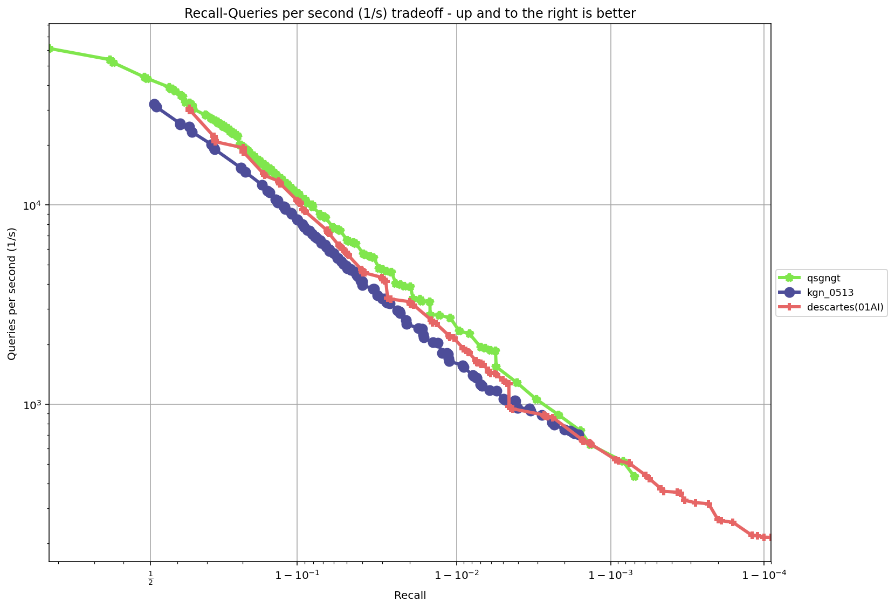
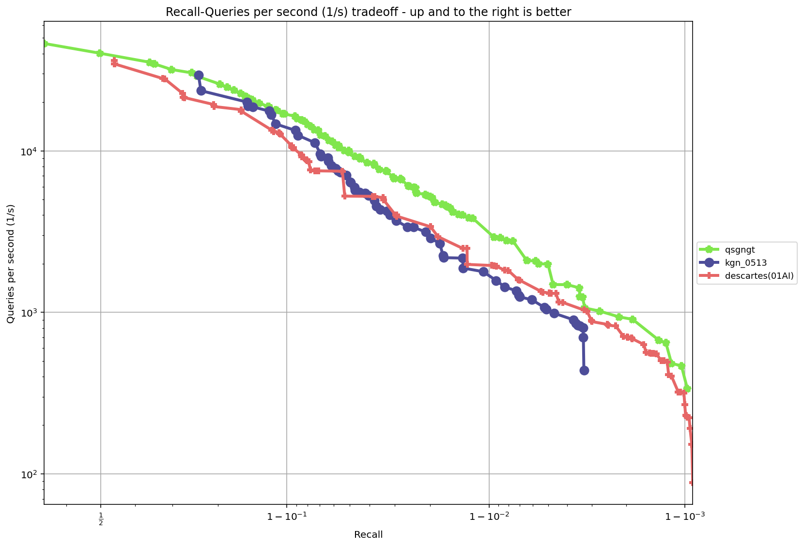

# kgn
---
## Introduction
KGN is a Nearest Neighbor Search algorithm, based on NSG

---

## Installation
### Step 1: Configure environment dependencies
```bash
sudo apt install -y git cmake g++ python3 python3-setuptools python3-pip libblas-dev liblapack-dev
pip3 install wheel pybind11 faiss-cpu
```
### Step 2: Clone the Repository
```bash
git clone https://github.com/Henry-yan/kgn.git
```
### Step 3: Install the package
```bash
pip3 install kgn/pykgn-1.0.0-cp310-cp310-linux_x86_64.whl
```
---
## Usage
```python
import pykgn
```


---
## Results
The test results from running [ann-benchmarks](https://github.com/erikbern/ann-benchmarks) on an AWS r6i.2xlarge instance are as follows:

### sift-128-euclidean
| Recall@10 | QPS |
| --- | --- |  
| 0.997 | 10965.896 | 
| 0.943 | 31347.704 |
| 0.918 | 36244.311 | 
| 0.867 | 42496.601 |
| 0.748 | 56619.339 |


---

### fashion-mnist-784-euclidean
| Recall@10 | QPS |
| --- | --- | 
| 1.000 | 8133.449 |
| 0.999 | 13661.276 |
| 0.996 | 21297.467 |
| 0.987 | 26630.163 |
| 0.932 | 38914.229 | 


---

### glove-100-angular
| Recall@10 | QPS |
| --- | --- |  
| 0.972 | 2343.888 |
| 0.900 | 9411.566 | 
| 0.885 | 11348.394 |
| 0.787 | 21024.987 |
| 0.633 | 35630.735 |



---

### nytimes-256-angular
| Recall@10 | QPS |
| --- | --- |  
| 0.971 | 2430.810 | 
| 0.926 | 7896.176 |
| 0.850 | 24092.056 | 
| 0.793 | 34103.748 |
| 0.697 | 46448.138 |



---